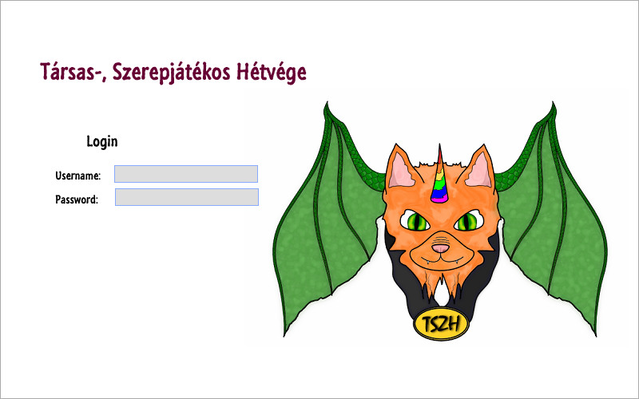
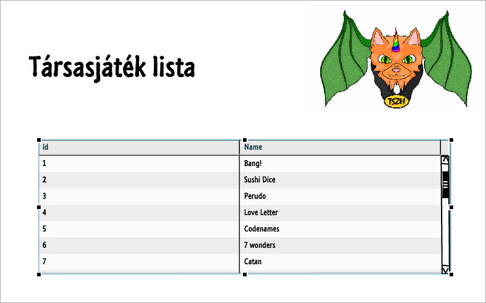
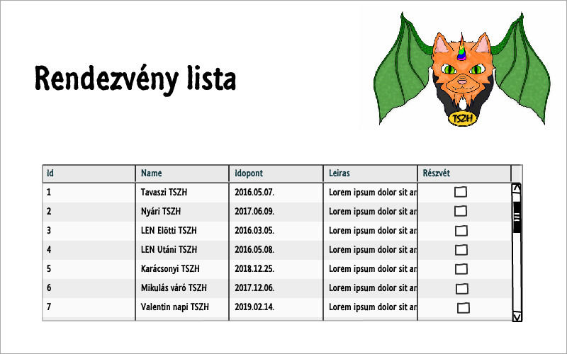
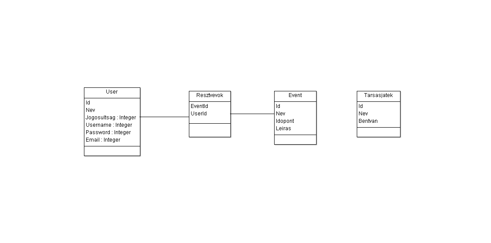

# Társas-, Szerepjátékos Hétvége oldala

##Funkcionális követelmények összegyűjtése

Az admin jogosultságú felhasználó tudjon az oldalon új eseményt létrehozni. 
Az admin jogosultságú felhasználó tudjon az oldalon meglévő eseményt szerkeszteni. 
A felhasználók tudják jelezni a részvételi szándékukat. 
Azoldal látógatói(nem belépett felhasználók) meg tudják nézni az aktuális társasjáték és rendezvény listát listát. 

##NEM FUNKCIONÁLIS KÖVETELMÉNYEK
Felhasználóbarát, ergonomikus elrendezés és kinézet. 
Gyors működés. 
Biztonságos működés: jelszavak tárolása, funkciókhoz való hozzáférés. 

##Szerepkörök, használati esetek, folyamatok meghatározása
Admin: Van joga rendezvényt létrehozni, módosítani és törölni és a társasjátékok listába is vehet fel esetleg törölhet elemek. 
Felhasználó : Van jog jelezni részvételi szándékát a rendezvényre. 
Látogató : Megtekintheti a rendezvények és a társasjátékok listájt. 

##Oldalfunkciók
Rendezvény létrehozása, törlése, módosítása 
Részvételi szándék jelzése 
Társasjáték lista lekérdezése. 

##Oldalvázlatok készítése

##Oldaltérkép
GET /: főoldal 
GET /login: bejelentkező oldal 
POST /login: bejelentkezési adatok felküldése 
GET /tarsas/list: társasjátéklista oldal 
GET /tarsas/new: új társasjáték felvitele 
POST /tarsas/new: új társasjáték felvitele, adatok küldése 
GET /rendezveny/list: rendezvénylista oldal 
GET /rendezveny/new: új rendezvény felvitele 
POST /rendezveny/new: új rendezvény felvitele, adatok küldése 
POST /rendezveny/going: részvételi szándék elküldése 

##Architektúra terv

##Adatbázis tervezése

##SZEREPKÖRÖK
Szervező
Belépett felhasználó
Látogató az oldalon

##Használati eset diagram

##FOLYAMATOK MEGHATÁROZÁSA
Login 

##Oldaltérkép

##Végpontok

##Oldalvázlat

##Adatmodel-Adatbázisterv

##Állapot diagam

##DESIGNTERV

Fejlesztő környezet:Visual Studio Code
